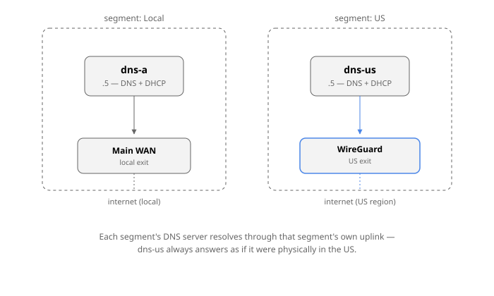

# It's always DNS

Code: [github.com/mabels/unified-dns-dhcp-chart](https://github.com/mabels/unified-dns-dhcp-chart)

For a long time DNS on my network was whatever my router shipped with:
MikroTik's built-in cache, forwarding to 1.1.1.1 and 8.8.8.8. It worked —
right up until anything needed local resolving, at which point it turned
into one small trick after another to patch around the gaps.

The obvious next step was Pi-hole. Except Pi-hole wants to *be* the DNS
server, which means moving it to its own IP, which means changing what
DHCP hands out, which means Pi-hole then needs its own special
configuration for this case and that case — and after enough of that I
gave up and went back to the router's cache. Then came the itch for DoH.
My router at the time didn't support it, and even once that got solved
somewhere else, I ran into the same catch: I wanted to specify the
forwarder by its symbolic hostname, not a bare IP, so TLS certificate
validation actually meant something — and getting that right end-to-end
was never quite clean.

## The idea that escalated everything

Somewhere in there I had the idea of running multiple internal network
segments, each with its own SSID — something like `BE-IN-THE-US` — so that
switching "region" was as simple as switching which Wi-Fi you're on,
instead of toggling a VPN by hand on every device. That one idea is what
broke everything else. Each of those segments needed its own DNS cache
server, bound into its own VRF, with DHCP that also worked correctly
inside that VRF — and that's exactly where MikroTik's configuration model
falls over. It's not a licensing problem or a hardware problem, it's a
"this appliance was never built to have more than one of itself" problem.

The reason a segment needs its *own* cache isn't cosmetic: if you're
logically in a different region, your DNS has to resolve *through* that
region, or the geo-DNS answers you get back point at servers for the
wrong one entirely. A DNS server sitting outside a segment's own routing
context will happily resolve through the wrong uplink and hand back
addresses for a country you're not routing traffic to.

I looked at other router vendors at that point, assuming MikroTik was
just unusually limited. They weren't — OPNsense, VyOS, the rest, all hit
the same wall in roughly the same place. I filed the wish with MikroTik
and let it sit for the better part of a year. Nothing.

## Going it alone: one DNS server per segment

Eventually I stopped waiting and reframed the whole thing: run completely
independent DNS servers, one per segment, each with everything else that
implies — DHCP creating both the forward zone (`*.mydomain`) and the
matching reverse zone (`*.in-addr.arpa`) automatically as leases are
handed out. And since I was building real infrastructure anyway, not just
a router feature, I decided to run it on my Kubernetes cluster.

The software choice took a while. `dnsmasq` was the obvious lightweight
default, but too simple and with no API to build anything further on top
of. What I actually wanted, on top of "lightweight, well-known, proven,"
was a UI that showed the last DHCP-assigned hostname/IP at a glance —
the single most useful thing when you're onboarding a new IoT device and
need to find it *right now*. Nothing quite fit; Pi-hole in particular is
not a pleasant thing to run inside a container.

With Claude's help I landed on a four-piece stack: **Unbound** as the
forwarding/caching resolver with DNSSEC validation, **Knot** as the
authoritative store for reverse zones, and **Kea DHCP** plus **Kea DDNS**
as the authoritative server for forward records. Getting all four running
on ARM took real effort, but it worked: one pod per segment with all four
containers, Multus handling the VLAN attachment so the pod got a real IP
out of the segment's own range (`.5`, in my numbering), DHCP adjusted to
match.

## The chicken-and-egg problem

It worked — until I noticed what I'd actually built. Running DNS *on* the
main Kubernetes cluster means the cluster's own boot sequence now depends
on DNS that lives inside the cluster. Every reboot became a small gamble
on whether everything would come back up in the right order.

The fix, at the time, was to move the whole stack off-cluster onto a
dedicated Raspberry Pi — an 8 GB model turned out to be the minimum that
would actually hold it. That solved the ordering problem, but introduced
a new one: Knot's authoritative store doesn't like being rebooted, and
after some power outages it just wouldn't come back without manual
intervention. I'd traded a boot-order gamble for a second machine to
babysit, on top of the central VM host (TrueNAS, at the time).

It worked, but "worked" was doing a lot of lifting. The UI never got the
attention it needed, metrics were scattered across four separate
components instead of living anywhere central, and proper monitoring was
— and still is — unsolved. The real test of "is DNS actually healthy" is
a dedicated machine that boots, checks that DHCP, DNS, and routing all
came up correctly, records that result somewhere, and only then switches
over to collect it — and I never got around to building that. It's still
on the list.

## Rethinking it: one central, resilient stack

The part I kept coming back to was that I didn't want *another* standalone
machine doing something this central to the network. That's what sent me
looking again, and that's how I found **Technitium DNS Server** — a much
nicer UI, real built-in statistics, and fast enough to start that I could
run it from Proxmox and have it up very early in the boot sequence.

Technitium isn't really designed to be driven entirely by automation
across several independent network configurations without someone
clicking through its UI — but with Claude's help I found a way to make it
work anyway. It costs one extra boot cycle just to extract the API key on
first run, which is a fine trade for everything it replaces.

What came out of that is the [`unified-dns-dhcp` Helm
chart](https://github.com/mabels/unified-dns-dhcp-chart): Technitium plus
a small set of sidecars (a Deno configurator that applies all DNS/DHCP
state through Technitium's REST API, an optional metrics exporter),
running one StatefulSet per segment on the central Kubernetes cluster,
attached to each segment's VLAN through Multus on a dedicated node. That
last part is what actually closes the loop from the earlier chicken-and-egg
problem: the Kubernetes cluster itself can be taken down for maintenance
without taking DNS down with it, because the node keeps whatever was
already running going through the reboot — and only reconciles back to
the cluster's desired state once Kubernetes is back.

It's not the last word on any of this — monitoring is still the open
piece — but it's the first version of this whole saga where DNS survives
the thing that's supposed to be running it going away for a while.
